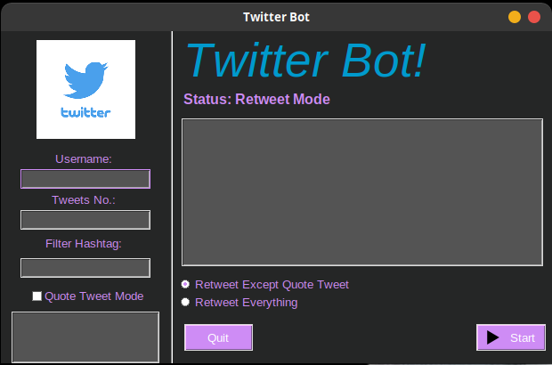

[![Contributors][contributors-shield]][contributors-url]
[![Forks][forks-shield]][forks-url]
[![Stargazers][stars-shield]][stars-url]
[![Issues][issues-shield]][issues-url]
[![MIT License][license-shield]][license-url]


<!-- PROJECT LOGO -->
<br />
<p align="center">
  <a href="https://github.com/othneildrew/Best-README-Template">
    
  </a>

  <h3 align="center">Twitter Bot</h3>

  <p align="center">
    An awesome bot to jumpstart your trending tweets!
    <br />
    <a href="https://github.com/waihankan/twitter-bot"><strong>Explore the docs »</strong></a>
    <br />
    <br />
    ·
    <a href="https://github.com/waihankan/twitter-bot/issues">Report Bug</a>
    ·
    <a href="https://github.com/waihankan/twitter-bot/issues">Request Feature</a>
  </p>
</p>


<!-- TABLE OF CONTENTS -->
<details open="open">
  <summary>Table of Contents</summary>
  <ol>
    <li>
      <a href="#about-the-project">About The Project</a>
      <ul>
        <li><a href="#built-with">Built With</a></li>
      </ul>
    </li>
    <li>
      <a href="#getting-started">Getting Started</a>
      <ul>
        <li><a href="#prerequisites">Prerequisites</a></li>
        <li><a href="#installation">Installation</a></li>
      </ul>
    </li>
    <li><a href="#usage">Usage</a></li>
    <li><a href="#roadmap">Roadmap</a></li>
    <li><a href="#contributing">Contributing</a></li>
    <li><a href="#license">License</a></li>
    <li><a href="#contact">Contact</a></li>
    <li><a href="#acknowledgements">Acknowledgements</a></li>
  </ol>
</details>


<!-- ABOUT THE PROJECT -->
## About The Project

This twitter bot is developed for following a specific person/user acouunt and retweet all the tweets of his/her timeline.
Initial Purpose was the mass trending in twitter about **Myanmar** current situations.
However, the project is not super user-friendly yet. I am looking for contributors who can make gui apps, improve code, make new features, fix known issues etc...

### Built With

* [Python3.9](https://www.python.org/)
* [Tweepy](https://docs.tweepy.org/en/latest/api.html)


<!-- GETTING STARTED -->
## Getting Started
### Prerequisites

* Python 3.9
  ```sh
  sudo apt-get update
  ```
  ```sh
  sudo apt-get install python 3.9
  ```
  ```sh
  sudo apt-get install python3-pip
  ```

### Installation

1. Get a free twitter API Key at [https://developer.twitter.com/en](https://developer.twitter.com/en)
2. Clone the repo
   ```sh
   git clone https://github.com/waihankan/twitter-bot.git
   ```
3. Install pip packages
   ```sh
   pip install -r requirements.txt
   ```
4. Enter your API in `config.py`


   **Make a `config.py` file if it doesn't exist**
   ```PY
   api_key="your_api"
   api_secret="your_api_secret"
   access_token="your_access_token"
   token_secret="your_token_secret"
   ```


<!-- USAGE EXAMPLES -->
## Usage

Here is how to use the code as of latest source code.

1. Run the file `main.py` in the terminal.

2. You have to fill in the twitter api if you use the code for the first time.You can take a look at the demo images provided below.

3. Rerun the file `main.py` in the terminal.

4. This time the twitter bot window will pop up.

5. 1. Add the user_id, which is @*user_id* in the twitter profile.
   2. Add the number of retweets you want to retweet from that user.

6. Click Start! and check the process in terminal.

## Demo Images

 

<!-- ROADMAP -->
## Roadmap

See the [open issues](https://github.com/waihankan/twitter-bot/issues) for a list of proposed features (and known issues).


<!-- CONTRIBUTING -->
## Contributing

Contributions are what make the open source community such an amazing place to be learn, inspire, and create. Any contributions you make are **greatly appreciated**.

1. Fork the Project
2. Create your Feature Branch (`git checkout -b feature/AmazingFeature`)
3. Commit your Changes (`git commit -m 'Add some AmazingFeature'`)
4. Push to the Branch (`git push origin feature/AmazingFeature`)
5. Open a Pull Request


<!-- LICENSE -->
## License

Distributed under the MIT License. See `LICENSE` for more information.


<!-- CONTACT -->
## Contact

[@Wai Han](https://twitter.com/WaiHan49607875) - wh.kankan13@gmail.com

Donate Me -> [@Wai Han](https://paypal.me/WaiHanYangon?locale.x=en_US)

<!-- ACKNOWLEDGEMENTS -->
## Acknowledgements
* [GitHub Emoji Cheat Sheet](https://www.webpagefx.com/tools/emoji-cheat-sheet)
* [Best Readme](https://github.com/othneildrew/Best-README-Template)

<!-- MARKDOWN LINKS & IMAGES -->
<!-- https://www.markdownguide.org/basic-syntax/#reference-style-links -->
[contributors-shield]: https://img.shields.io/github/contributors/waihankan/twitter-bot.svg?style=for-the-badge
[contributors-url]: https://github.com/waihankan/twitter-bot/graphs/contributors
[forks-shield]: https://img.shields.io/github/forks/waihankan/twitter-bot.svg?style=for-the-badge
[forks-url]: https://github.com/waihankan/twitter-bot/network/members
[stars-shield]: https://img.shields.io/github/stars/waihankan/twitter-bot.svg?style=for-the-badge
[stars-url]: https://github.com/waihankan/twitter-bot/stargazers
[issues-shield]: https://img.shields.io/github/issues/waihankan/twitter-bot.svg?style=for-the-badge
[issues-url]: https://github.com/waihankan/twitter-bot/issues
[license-shield]: https://img.shields.io/github/license/waihankan/twitter-bot.svg?style=for-the-badge
[license-url]: https://github.com/waihankan/twitter-bot/blob/master/LICENSE
[product-screenshot]: images/screenshot.png
